# Handoff: 師傅報價單 App（裝潢／工程報價單管理）

## Overview

A mobile quote management app for Taiwanese tradespeople (裝潢師傅 / 工程師傅) — contractors who do home renovation. Lets them build itemized quotes for customers, track each job's status (進行中 / 已完工 / 已收款), maintain a client book, generate branded PDFs, convert quotes to invoices, and view yearly business statistics. Designed for iOS first; iPhone layouts at 402×874pt.

Key flows covered:

1. **First-run onboarding** — welcome → 3-point feature intro → "build your first quote" tutorial CTA with coach marks
2. **Quote creation** — 3 steps (basic info → pick items → review + finalize) with optional address picker (map) and asks for the 商號抬頭 once on first quote
3. **Quote management** — home list with filters/search, drill-in to detail with branded PDF preview, native iOS share, copy-as-new, convert-to-invoice
4. **Statistics** — yearly paid/done/ongoing totals, monthly income bar chart, top clients (drillable), top items (drillable to price history)
5. **Client book** — full contact directory with phone / email / address, one-tap call & navigate, inline add-new client sheet
6. **Settings** — PRO subscription banner, iCloud sync, business header (報價單抬頭), PDF template editor (logo/stamp/payment terms/signature/brand color/font), category management, custom item library, currency / language / tax region, font scale & dark mode (via in-design tweaks)
7. **Monetisation** — free tier (3 quotes/month + watermark), Pro subscription page

## About the Design Files

The files in this bundle are **design references created in HTML** — interactive prototypes showing intended look and behaviour, not production code to ship as-is. The job is to **recreate these designs inside the target codebase's existing environment** (SwiftUI, React Native, Flutter, etc.), using its established patterns and libraries.

Open `index.html` in a browser to walk every screen — all 21 artboards are interactive iPhones in a design canvas, and you can fullscreen any one of them to test the flow.

## Fidelity

**High-fidelity (hifi).** Exact colors, typography, spacing, radii, and component states are specified. Match the visuals pixel-faithfully using the codebase's existing styling system. Sample data, placeholder addresses, the faux map view, and the PDF preview are *mockups* — wire up real data + a real map SDK (Apple MapKit / Google Places) + a real PDF renderer (Apple PDFKit / wkhtmltopdf-equivalent) when implementing.

## Screens / Views

All screens are 402×874pt (iPhone size). Status bar at top (47pt), home indicator at bottom (34pt). Content sits between.

Screenshot reference (one per artboard, captured from the live prototype):

| # | File | Screen |
|---|---|---|
| 01 | `screens/01-splash.png` | 歡迎 / Splash |
| 02 | `screens/02-intro.png` | 功能介紹 (3 feature points) |
| 03 | `screens/03-tutorial-cta.png` | 教學 CTA |
| 04 | `screens/04-new-info.png` | 新增報價單 — 基本資料 |
| 04b | `screens/04b-new-info-map.png` | 從地圖選地點 (LocationPickerSheet) |
| 05 | `screens/05-new-items.png` | 加項目（單頁版） |
| 05b | `screens/05b-new-items-custom.png` | 加項目 — 自訂 tab |
| 05c | `screens/05c-new-items-sheet.png` | 加項目 v2（sheet 主畫面） |
| 05d | `screens/05d-new-items-sheet-open.png` | 加項目 v2 + sheet 展開 |
| 06 | `screens/06-new-review.png` | 確認出單 |
| 07 | `screens/07-exported.png` | 出單完成 |
| 08 | `screens/08-home.png` | 報價單列表 |
| 09 | `screens/09-detail.png` | 報價單詳情（含客戶卡） |
| 10 | `screens/10-stats.png` | 營運統計 |
| 11 | `screens/11-settings.png` | 設定（含 PRO banner / iCloud / 國際化） |
| 12 | `screens/12-contacts.png` | 客戶簿 |
| 12b | `screens/12b-new-client.png` | 新增客戶 (NewClientSheet) |
| 13 | `screens/13-pdf-template.png` | PDF 模板自訂 |
| 14 | `screens/14-pdf-preview.png` | PDF 預覽 sheet |
| 15 | `screens/15-invoice.png` | 請款單 (從報價單轉換) |
| 16 | `screens/16-paywall.png` | 訂閱 PRO |

> The v2 picker variant (05c / 05d) is the **preferred** iOS-native pattern.
> Native iOS share sheet (UIActivityViewController) is used for sharing — we do NOT design a custom share UI.

---

### 01 · 歡迎（Splash）
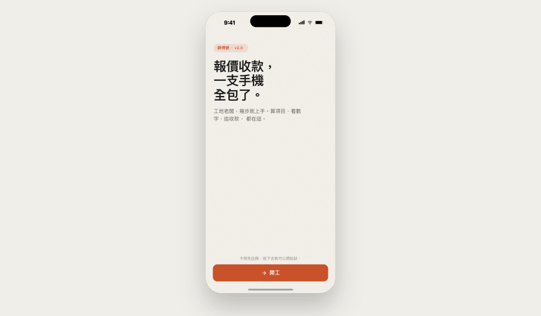
- **Purpose**: First app launch, sets the tone.
- **Layout**: Vertical centered. Hero text top, CTA + footnote pinned to bottom (`BottomCTA` pattern — see Components).
- **Hero copy**: "報價收款，一支手機全包了。" / Subhead: "工地老闆，幾步就上手。算項目、看數字、追收款，都在這。"
- **CTA**: 「開工」full-width primary button.
- **Footnote**: 「不用先註冊，按下去就可以開始試。」(centered, faint gray)
- **No name input** — keep frictionless. Name is asked later at first quote finalization.

### 02 · 功能介紹（Intro）
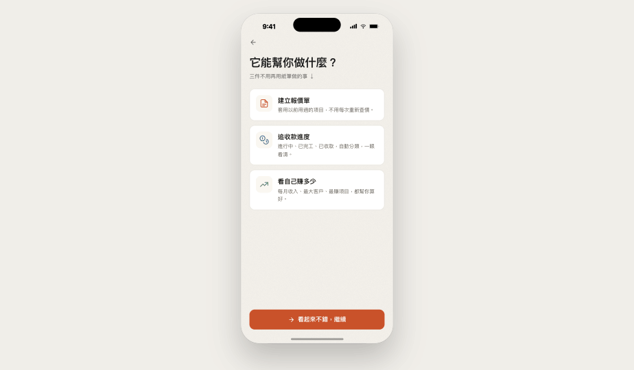
- **Purpose**: 3-point value prop.
- **Layout**: Back arrow top-left, title, sub-title, 3 stacked cards.
- **Title**: 「它能幫你做什麼？」 / Sub: 「三件不用再用紙筆做的事 ↓」
- **3 cards** (each: icon avatar + title + 1-line desc):
  1. 建立報價單 — 套用以前用過的項目，不用每次重新查價。
  2. 追收款進度 — 進行中、已完工、已收款，自動分類，一眼看清。
  3. 看自己賺多少 — 每月收入、最大客戶、最賺項目，都幫你算好。
- **CTA**: 「看起來不錯，繼續」

### 03 · 教學 CTA（TutorialCTA）
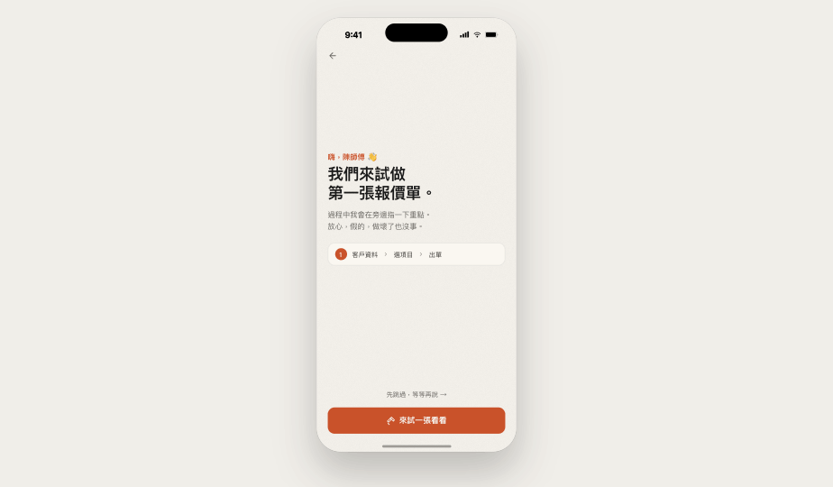
- **Purpose**: Invite the user to walk through making a real first quote.
- **Title**: 「嗨，師傅 👋」 / 「我們來試做第一張報價單。」
- **Body**: 「過程中我會在旁邊指一下重點。放心，假的，做壞了也沒事。」
- **Step chip**: A small surface-alt card showing `[1 客戶資料] → [選項目] → [出單]`
- **CTA**: 「來試一張看看」(primary) / 「先跳過，等等再說 →」(text link above primary)

### 04 · 新增報價單 — 基本資料
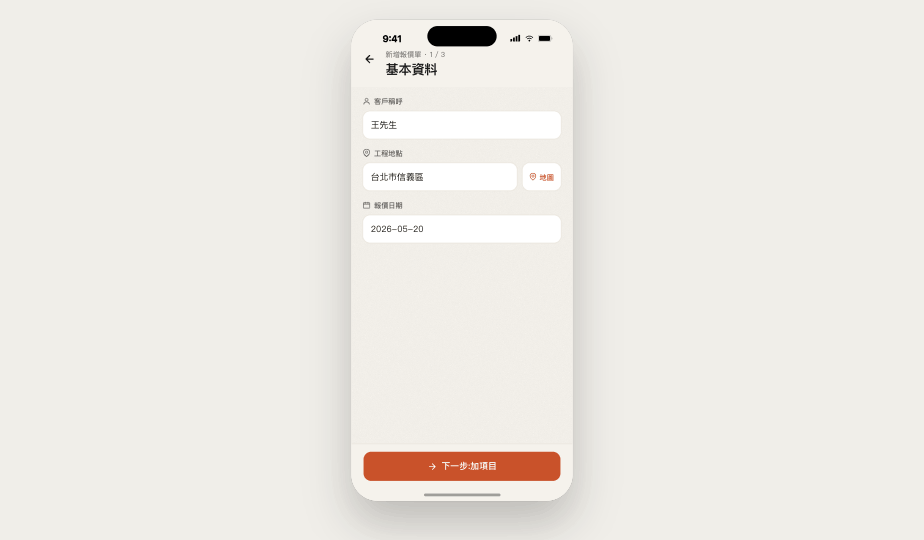
- **Purpose**: First step of quote creation.
- **Fields** (each as `FieldRow` with icon + label + input):
  - 客戶稱呼 (User icon)
  - 工程地點 (MapPin icon) — TextInput + 「📍 地圖」secondary button that opens the map picker (sheet)
  - 報價日期 (Calendar icon) — defaults to today
- **CTA**: 「下一步:加項目」
- **Coach mark** (only in first-run tutorial mode): bubble at top — "先填客戶稱呼跟地點就好。日期已經幫你填好今天了 — 不夠的之後再補沒關係。"

### 04b · 從地圖選地點（LocationPickerSheet）
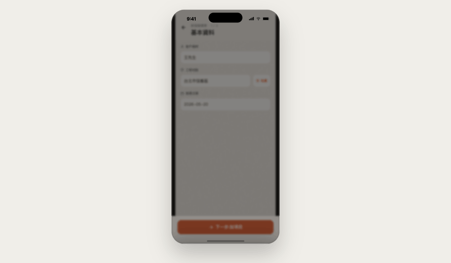
- **Purpose**: Pick the work location from a map / address autocomplete.
- **Presentation**: Bottom **page sheet** (iOS modal style) — height = `calc(100% - 22px)`, parent scales to 0.93 + corner-radius 14 + opacity 0.85, dim layer behind.
- **Content**:
  - Drag handle (38×5px gray pill, top center)
  - Header: "從地圖選地點" + X close button
  - **Faux map** (220px tall stylized map with grid lines, road overlays, building blocks, park circle, and a center red drop-pin showing the pinned address in a label callout above)
  - 「使用目前位置」row with GPS indicator and ±10m label
  - Search input (magnifying glass leading icon)
  - Suggestion list: 4 sample addresses with labels (附近最新工地, 台北市政府, 上次去過, 老客戶家); selected one shows checkmark
  - Bottom: 「確認此地點」primary button
- **Real implementation**: use Apple MapKit (native) or Google Places Autocomplete (cross-platform). The address text input should accept free-form text too.

### 05 · 加項目 — Picker inline (legacy / single-screen)
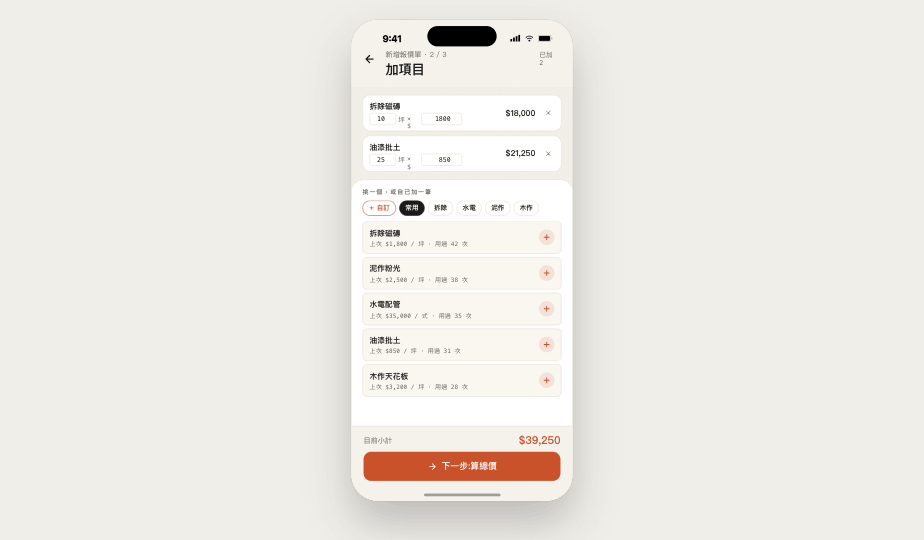
- **Purpose**: Add line items to the quote.
- **Layout** (top to bottom):
  - Header with "已加 N" count in trailing slot
  - Current items list (scrollable; each row: name + inline qty input + unit + × + inline price input, with delete X icon + line subtotal)
  - **Library picker section** with surface background:
    - Section title: 「挑一個，或自己加一筆」
    - Tab row: `[+ 自訂] [常用] [拆除] [水電] [泥作] [木作]` — first tab is custom (orange outline), others are categories. Active = orange-filled pill.
    - Tab content: list of library items with name + "上次 $X / unit · 用過 N 次" + circular orange `+` button to add
  - BottomCTA with running subtotal + "下一步:算總價"

### 05b · 加項目 — 自訂 tab content
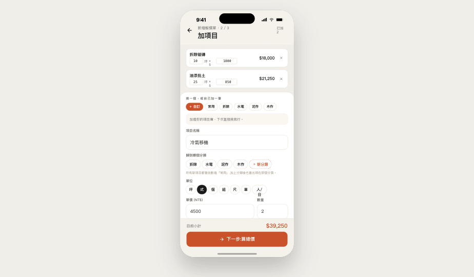
- Same screen, but with `自訂` tab active. Shows the `CustomItemForm`:
  - Hint card: 「加進你的項目庫，下次直接挑就行。」
  - 項目名稱 input
  - 歸到哪個分類 — chip selector showing all categories except 常用, plus a dashed orange `+ 新分類` chip that expands to show a category-name input
  - 單位 — chip selector (坪 / 式 / 個 / 組 / 尺 / 車 / 人/日)
  - 單價 + 數量 (two-column)
  - **Live preview row** (dashed orange border): shows the item as it would appear
  - 「加進去」 secondary button (transparent, orange border) — distinct from the bottom primary

### 05c · 加項目 — sheet-presented (preferred)
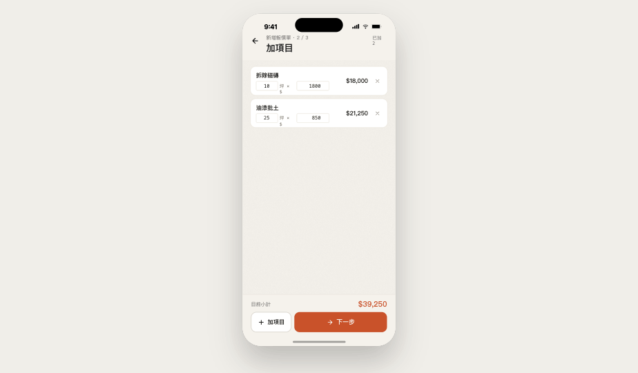
- **Same data model**, restructured so:
  - Main view is just the items list (empty state if none)
  - Bottom CTA shows two buttons side-by-side: secondary "+ 加項目" (opens the picker sheet) + primary "下一步" (advances)
  - When 加項目 is tapped, the **picker sheet** is presented (iOS page-sheet style; same proportions as 04b)
  - After adding each item, a small toast "已加 「項目名」" appears top-center for 1.4s; sheet stays open for batch adds
- **Why preferred**: more iOS-native, lets the user see what they've already added without losing the picker.

### 05d · 加項目 v2 — sheet open state
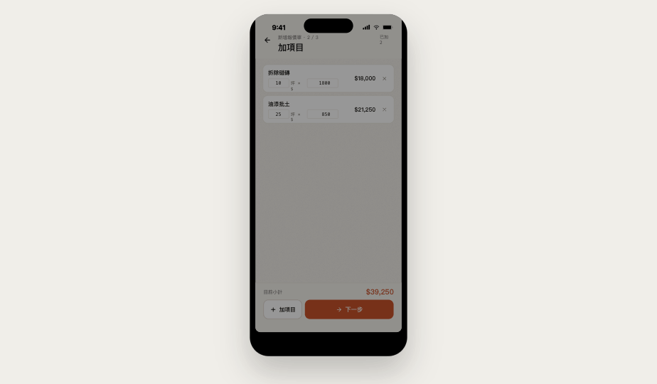
- Snapshot of 05c with the picker sheet presented. Shows the parent scaled + dimmed behind the sheet.

### 06 · 確認出單 — 報價單抬頭 + 明細 + 總計
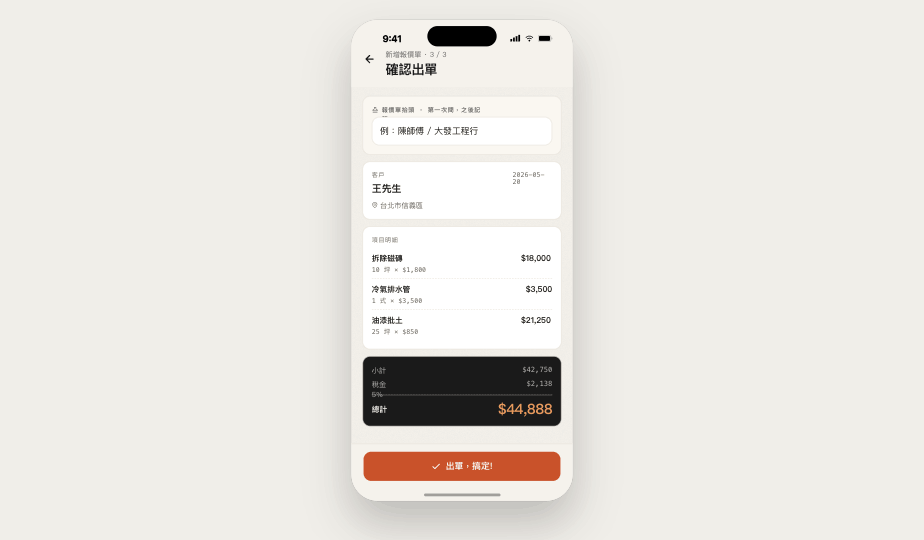
- **Purpose**: Review the quote, fill in your business name on first use, finalize.
- **Conditional first card** (only when `name` is empty — first-time finalizer): "報價單抬頭" with stamp icon + 「第一次問，之後記著」 + name input ("例：陳師傅 / 大發工程行"). Background: surface-alt.
- **Customer card**: 客戶 / date / location (MapPin icon)
- **Items card**: each row = name + qty/unit/price (mono) + subtotal money. Dashed dividers between items.
- **Totals card** (`accent` styled — dark surface): 小計 / 稅金 5% / divider / 總計 (large peach money)
- **CTA**: 「出單，搞定!」 with checkmark icon

### 07 · 出單完成
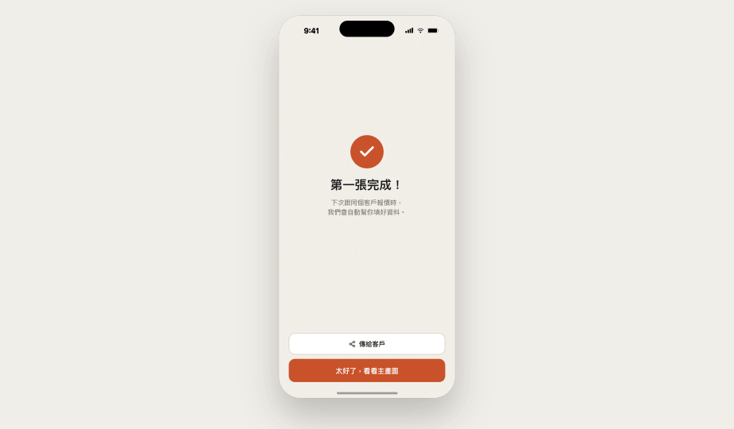
- **Purpose**: Confirmation + next-step prompt.
- **Hero**: large circular orange check icon → 「第一張完成！」 (first time) or 「出單完成」 → "下次跟同個客戶報價時，我們會自動幫你填好資料。"
- **CTA**: 「太好了，看看主畫面」 (primary) + 「📤 傳給客戶」 (secondary)

### 08 · 報價單列表（Home）
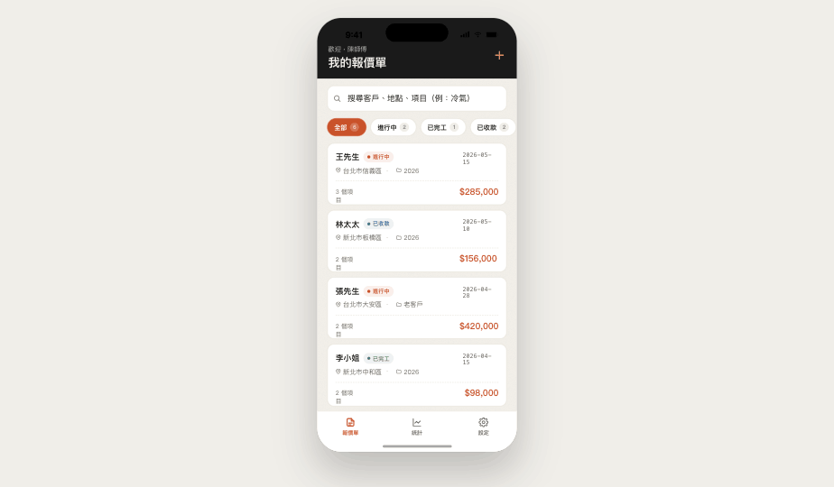
- **Purpose**: Main landing screen; browse and filter quotes.
- **Header**: accent-surface (dark cap) with subtitle "歡迎，陳師傅" + title "我的報價單" + trailing `+` icon button (iOS-style, plain tinted, no fill — opens new quote flow).
- **Search bar** with magnifying glass leading icon: "搜尋客戶、地點、項目（例：冷氣）"
- **Filter tab row** (horizontally scrollable):
  - [全部 · count]
  - [• 進行中 · count] (with status dot)
  - [• 已完工 · count]
  - [• 已收款 · count]
  - [📁 2026 · count]
  - [📁 老客戶 · count]
  - Active tab = orange filled pill (always — does not invert in dark mode).
- **Quote cards** (each): single tap target → drills to quote detail.
  - Top row: client name + status badge + folder badge + date (mono, right-aligned)
  - Location row with map pin + 地點 [· folder]
  - Dashed divider
  - Bottom row: "N 個項目" left, money (large, orange) right
- **Bottom TabBar**: [報價單 / 統計 / 設定] — 3 tabs.

### 09 · 報價單詳情（Detail）
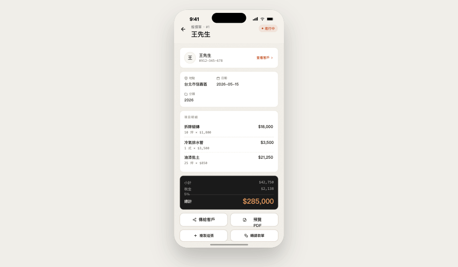
- **Purpose**: View one quote in full and act on it.
- **Header**: accent surface, subtitle "報價單 · #1234" + client name + trailing status badge (large).
- **Client card** (first card, tappable → ClientDetail): Avatar + 客戶名 + 電話 + "查看客戶 →" orange link.
- **Facts card**: 地點 / 日期 / [分類] inline factoids with icons + small mono labels.
- **Items card**: 項目明細 section title + list of items (name / qty·unit·price mono / subtotal money). Dashed dividers.
- **Totals card** (accent): 小計 / 稅金 5% / divider / 總計 (large peach money)
- **Primary actions** (row 1): 📤 傳給客戶 (triggers native iOS share sheet via UIActivityViewController — do NOT design a custom share UI) / 📄 預覽 PDF (opens PDFPreviewSheet)
- **Secondary actions** (row 2): + 複製這張 (clones the quote into draft, jumps to review step) / 💰 轉請款單 (only shown for status 'ongoing'/'done' — opens InvoiceScreen)

### 10 · 營運統計（Stats）
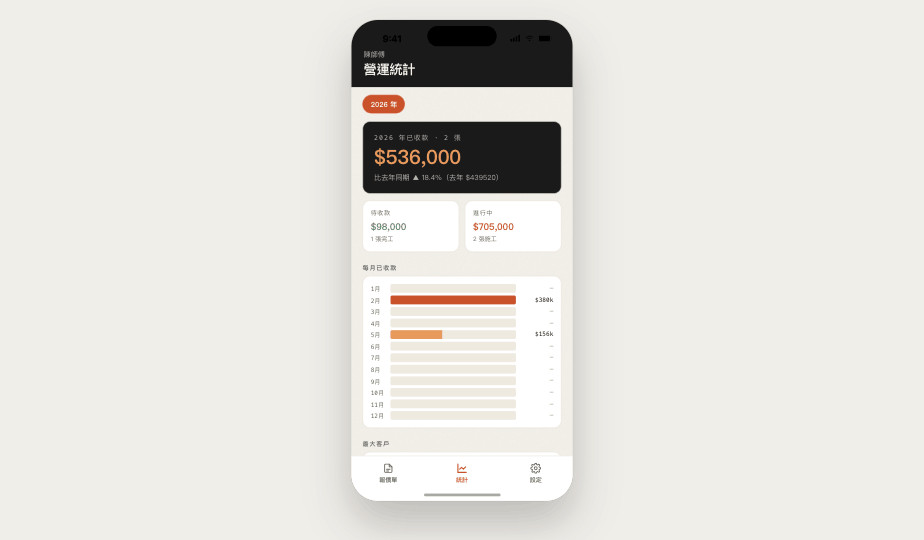
- **Header**: accent-surface (dark) with subtitle = name, title "營運統計"
- **Year switcher**: horizontal scrolling pills (2024 / 2025 / 2026), active = orange filled.
- **Hero card** (accent, dark): "2026 年已收款 · N 張" + huge peach amount + YoY change line (▲/▼ % + delta vs prev year)
- **Mini stat row** (2-column): 待收款 (positive green) / 進行中 (accent orange), each with N 張 sub-label
- **平均單張報價** card (split: avg amount left / total quote count right)
- **每月已收款 chart**: rows of [month label · horizontal bar · amount mono]. Highest month bar is full-saturation accent, others are lighter accent2.
- **最大客戶 card** (clickable → 客戶詳情): 🏆 + name + chevron + count below; revenue right.
- **最常做的項目** list (clickable → 項目詳情): ranked rows (1/2/3/4/5) with rank circle (first=orange filled, rest=neutral), name + count·qty sub, revenue + chevron right.
- **最賺錢的項目** list (similar, ranked by revenue, first rank circle uses cool blue).
- **Bottom TabBar** active = 統計.

### 客戶詳情（ClientDetailScreen — drilled from stats / home / contacts）
- **Header** with back arrow, subtitle "客戶詳情" + name
- **Hero accent card**: 累計營收 + huge peach number + "合作 N 次 · 自 YYYY-MM 起"
- **Contact card** (when client is in client book): phone with 撥打 chip → tap calls; address with 導航 chip → tap opens Maps; optional Email; optional notes (📝)
- **Pending card** (positive border-left): 待收款 + amount in positive green + N 張已完工待收
- **Tags row**: 常為他做 — pill list of common items with ×count
- **History list**: section title with count + each historical quote as a card (clickable → DetailScreen)

### 項目詳情（ItemDetailScreen — drilled from stats）
- **Header** with back arrow + subtitle "項目分析" + item name
- **Hero accent card**: 累積營收 (peach) + N 次 + "共做了 N 單位"
- **Two-column cards**: 最近單價 (current price + unit) / 價格趨勢 (▲/▼ % + price range)
- **單價歷史 list**: ranked rows showing client + date + qty · unit + price + tag (最高 orange / 最低 positive green)

### 11 · 設定（Settings）
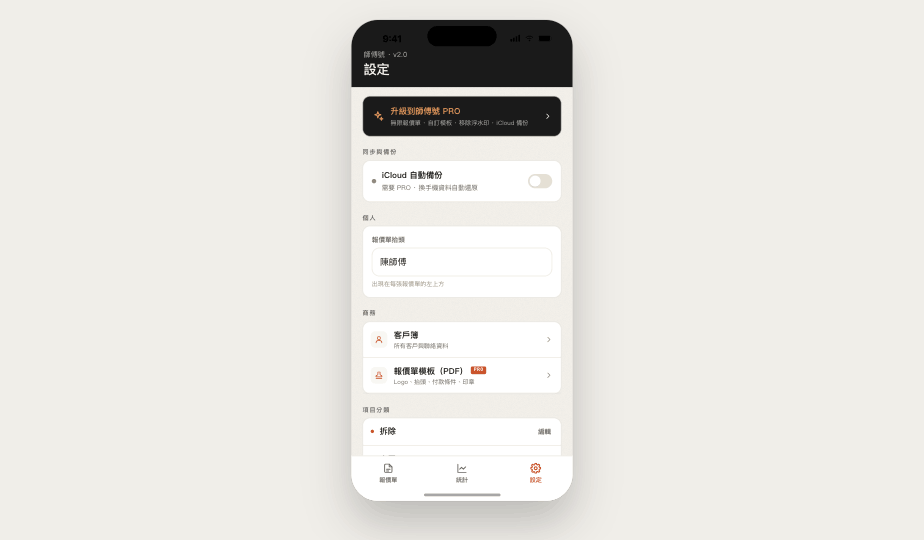
- **Purpose**: Top-level tab. Manage subscription, sync, profile, categories, custom items, international settings.
- **Header**: accent-surface, subtitle "師傅號 · v2.0", title "設定" (no back button — it's a tab)
- **PRO banner** (top-most card):
  - When NOT subscribed: dark accent-surface card → "升級到師傅號 PRO" with peach icon + "無限報價單 · 自訂模板 · 移除浮水印 · iCloud 備份" + chevron right → opens PaywallScreen
  - When subscribed: surface card with positive-green left border + "師傅號 PRO · 已訂閱 · 下次扣款 YYYY-MM-DD"
- **Section 同步與備份**: row "iCloud 自動備份" with status dot (green if pro / faint if free) + label + sub ("已啟用 · 最後同步 12 秒前" / "需要 PRO · 換手機資料自動還原") + toggle (off opens paywall)
- **Section 個人**: 報價單抬頭 (editable input + "出現在每張報價單的左上方" hint)
- **Section 商務**: rows linking to → 客戶簿 / 報價單模板（PDF）[shows PRO tag if not subscribed]
- **Section 項目分類**: list of categories (each row: bullet dot + name + 編輯 button + trash icon if removable). Built-in cats (拆除 / 水電 / 泥作 / 木作 / 油漆) cannot be deleted. Inline-edit on click. Footer row: "加新分類" input + small orange "加" button.
- **Section 我的自訂項目**: list of user-added items (name + price/unit + category tag). Each row has 編輯 + trash. Click 編輯 → row expands inline into editable form with name / category chips / unit chips / price / 取消儲存.
- **Section 國際化**: rows for 貨幣 (TWD/VND/IDR/USD/MYR/PHP), 語言 (zh-Hant / zh-Hans / en / vi / id), 稅制 (region-aware: 台灣 5% / 越南 VAT 10% / 印尼 PPN 11% / 馬來 SST 6% / 菲律賓 VAT 12%).
- **Section 其他**: 匯出全部資料 (Excel/CSV), App 設定 (通知/深色/字體).
- **Build stamp** footer: "師傅號 · v2.0 · build 2026.05.20" (mono, faint).
- **Bottom TabBar** active = 設定.

### 12 · 客戶簿（Contacts）
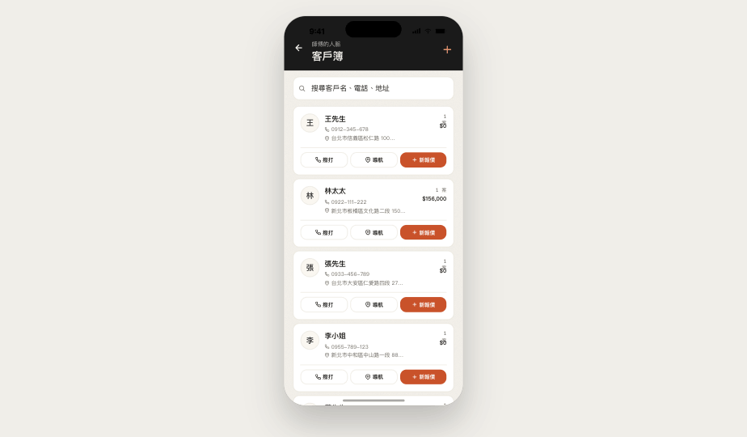
- **Header**: accent-surface, subtitle "師傅的人脈", title "客戶簿", trailing `+` icon (opens NewClientSheet).
- **Search bar**: "搜尋客戶名、電話、地址"
- **Client cards** (one per client):
  - Avatar (circle with first char of name) + name (display font) + phone (mono) + address (truncated)
  - Right column: quote count + accumulated paid revenue
  - Bottom row (separated by 1px divider): 3 quick action buttons spanning full width — 撥打 / 導航 / 新報價. The 新報價 is `primary=true` (filled orange).
- Tap on card → drills to ClientDetailScreen (the same screen reachable from Stats).

### 12b · 新增客戶（NewClientSheet）
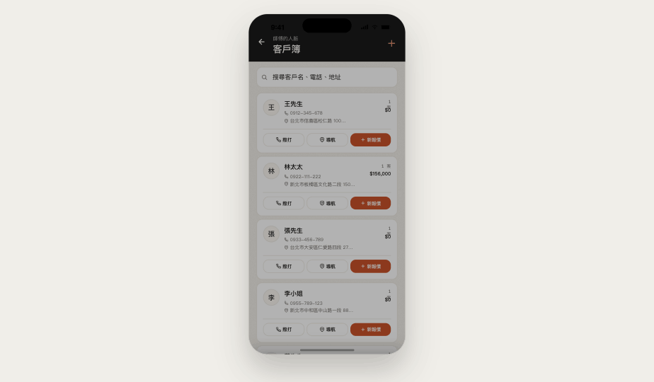
- **Presentation**: iOS page-sheet from Contacts top-right `+` button.
- **Sheet header**: three-segment nav — 取消 (left, gray) / 新增客戶 (center, bold) / 儲存 (right, accent orange when name filled, gray when empty).
- **Avatar preview**: large 72×72 circle that shows the first char of the entered name in orange, OR a dashed orange `+` placeholder when empty.
- **Fields**:
  - 客戶稱呼 ＊ (required) — User icon
  - 電話 — Phone icon (numeric keyboard)
  - Email (可省略) — Building icon
  - 工程地址 — MapPin icon, with the SAME "📍 地圖" button that opens LocationPickerSheet
  - 備註（可省略） — FileText icon, textarea 3 rows
- **Bottom hint card** (dashed): 「加進來後，未來的報價單只要輸入名字，地址跟電話會自動帶入。統計頁也會自動歸戶這位客戶的累計營收。」

### 13 · PDF 模板自訂
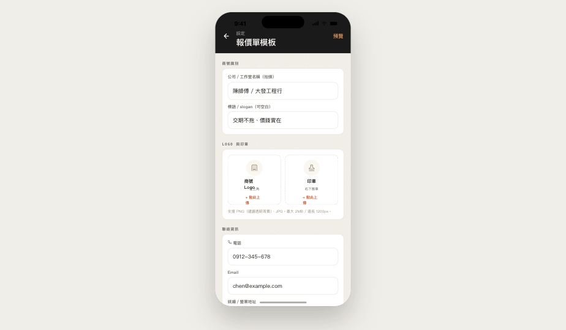
- **Header**: accent-surface, subtitle "設定", title "報價單模板", trailing text button "預覽" (opens PDFPreviewSheet)
- **Section 商號識別**: 公司／工作室名稱 + 標語／slogan
- **Section Logo 與印章**: two `UploadSlot`s side by side (logo / stamp) — circular icon placeholder, "+ 點此上傳" or "✓ 已上傳"; hint "支援 PNG / JPG，最大 2MB / 1200px"
- **Section 聯絡資訊**: 電話 / Email / 統編／營業地址
- **Section 付款條件 & 簽名**: textarea for payment terms + chip selector for 有效期限 (7/14/30/60/90 天) + dashed checkbox card "顯示甲乙方簽名欄"
- **Section 外觀**: 主色 (5 swatches — brick/black/blue/green/purple) + 字體 (黑體/明體/楷體 — three buttons)
- **PRO upsell card** (if not subscribed): dashed accent border + sparkle icon + "免費版限制：每月 3 張報價單，PDF 含浮水印。升級 Pro 解鎖無限張、自訂模板、移除浮水印。"

### 14 · PDF 預覽 sheet
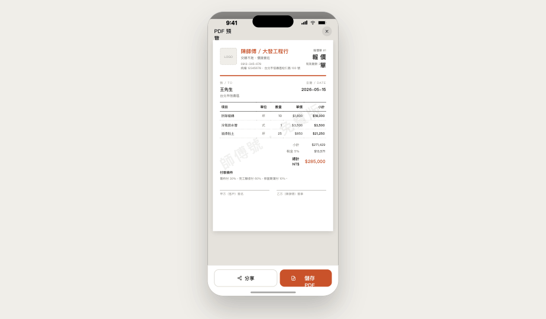
- **Presentation**: iOS page sheet from the detail screen's "預覽 PDF" button. Background: warm gray (`#E5E2DC`) to evoke a desk.
- **Sheet header**: drag handle + "PDF 預覽" + X
- **A4 paper preview** (white card with shadow):
  - **Letterhead**: logo placeholder (left) + business name (brand color) + slogan + phone/email/address (right column has quote number, large "報 價 單" title, validity period)
  - 3px bottom border in brand color
  - **致 / 日期** block (two columns)
  - **Items table**: 5 columns (項目 / 單位 / 數量 / 單價 / 小計), uppercase labels, dotted row dividers, tabular-nums on numeric columns
  - **Totals block** (right-aligned): 小計 / 稅金 5% / 總計 NT$ (large, brand color, 2px top border in brand color)
  - **Payment terms** (small text below)
  - **Signatures**: two signature lines (甲方 / 乙方), with stamp graphic overlapping the right line (if uploaded)
  - **Watermark** (free tier only): "師傅號 · 免費版" rotated -30°, opacity 0.06, behind all content
- **Sheet footer actions**: 分享 (secondary, calls native share) + 儲存 PDF (primary)

### 15 · 請款單（Invoice）
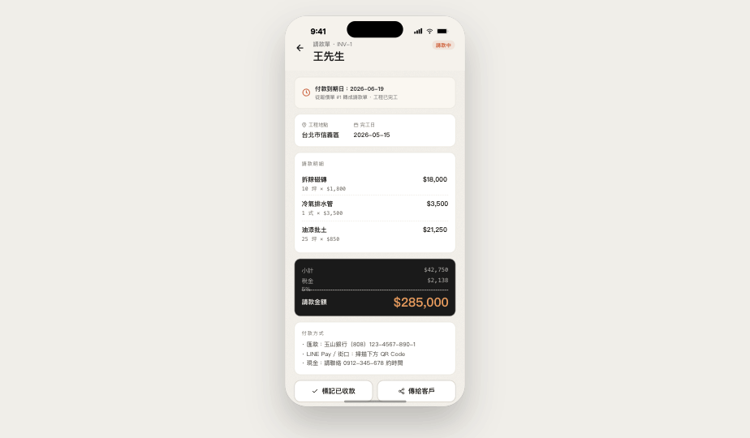
- **Purpose**: Convert a completed quote to an invoice for billing. Reachable from quote detail (status 'ongoing' or 'done').
- **Header**: accent-surface, subtitle "請款單 · INV-XXXX", title client name, trailing badge "請款中" (small orange pill, mono uppercase).
- **Due date card** (top): surface-alt with orange left border + Clock icon + "付款到期日：2026-06-19" + sub "從報價單 #XXXX 轉成請款單 · 工程已完工".
- **Facts card**: 工程地點 / 完工日.
- **Items card**: 請款明細 — same shape as quote detail items.
- **Totals card** (accent, dark): 小計 / 稅金 5% / **請款金額** (large peach money — different label than quote's 總計).
- **Payment methods card**: 付款方式 with bullet list — 匯款 (玉山銀行 808 帳號) / LINE Pay / 街口 (QR Code) / 現金.
- **Actions** (bottom row): 標記已收款 (secondary, check icon) / 傳給客戶 (secondary, share icon → native share).

### 16 · 訂閱 PRO
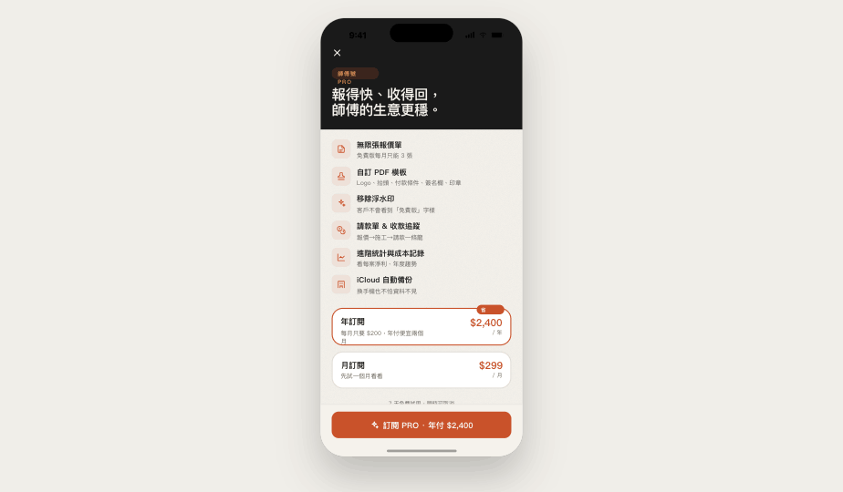
- **Purpose**: Sell the Pro tier.
- **Header**: full-bleed accent-surface (dark) hero — close `X` top left + pill chip "師傅號 PRO" (small mono) + 28px bold title "報得快、收得回，師傅的生意更穩。"
- **Feature list** (6 rows, each with icon avatar + title + sub):
  1. 📄 無限張報價單 — 免費版每月只能 3 張
  2. 🖋 自訂 PDF 模板 — Logo、抬頭、付款條件、簽名欄、印章
  3. ✨ 移除浮水印 — 客戶不會看到「免費版」字樣
  4. 💰 請款單 & 收款追蹤 — 報價→施工→請款一條龍
  5. 📊 進階統計與成本記錄 — 看每案淨利、年度趨勢
  6. ☁️ iCloud 自動備份 — 換手機也不怕資料不見
- **Plan picker** (2 cards):
  - 年訂閱: NT$ 2,400 / 年 — sub "每月只要 $200，年付便宜兩個月" — corner ribbon "省 33%"
  - 月訂閱: NT$ 299 / 月 — sub "先試一個月看看"
  - Selected card: 2px orange border. Unselected: 2px border-strong.
- **Bottom CTA**: primary button "訂閱 PRO · 年付 $2,400" or "月付 $299" depending on selection. Above CTA: small centered note "7 天免費試用，隨時可取消 / 訂閱透過 App Store 收費，可在「設定 → Apple ID」隨時關閉".

---

## Interactions & Behaviour

### Navigation
- Bottom tab bar: 3 top-level tabs (報價單 / 統計 / 設定) — instant switch, no animation between.
- New quote flow: linear 3-step push navigation. Back arrow returns to previous step.
- Drill-in detail screens (quote detail, client detail, item detail, invoice) push from list with back arrow.
- Sub-pages from Settings (Contacts, PDF Template, Paywall) push with back arrow.
- Paywall close icon is `X` (modal-style dismiss).

### Sheets (page-sheet presentation, used for picker / map / new-client / pdf-preview)
- Sheet height: `calc(100% - 22px)` (leaves a 22px peek strip at top)
- Parent transforms: `scale(0.93)` from top center; border-radius 14; opacity 0.85
- Dim layer: `rgba(0,0,0,0.3)` covering the parent
- Slide-up animation: 0.32s `cubic-bezier(.2,.7,.3,1)` from `translateY(100%)`
- Outer container background turns black when sheet open (so the peek band shows correctly)
- Drag handle: 38×5px pill, top center

### Sharing
- The 「傳給客戶」 button on quote detail / invoice / exported screens triggers the platform's **native share sheet** (iOS UIActivityViewController, Android Sharesheet, web `navigator.share`). The host OS provides LINE / WhatsApp / Email / Messages / AirDrop / Copy options.
- Do NOT design a custom share sheet — users already know the native one.

### Quote actions
- **Copy this quote** (複製這張): from DetailScreen, clones the quote into `draft` with today's date and 'draft' status, jumps directly to the 確認出單 step. User can edit before re-finalizing.
- **Convert to invoice** (轉請款單): from DetailScreen, when status is 'ongoing' or 'done', navigates to InvoiceScreen. The invoice inherits the quote's items + totals + client.
- **Long-press card menu** (optional / future): a context menu directly on home cards could expose 複製 / 分享 / 標記已收款 / 刪除 without going through detail first.

### Coach marks (first-run tutorial)
- Speech-bubble overlay with arrow pointing at the target field/button
- Sticky position above (top) or below (bottom) the focused element
- Black background bubble with cream text + small "STEP N / 3" mono label
- Dismissed by tapping "知道了" or interacting away; reactivated on next screen during tutorial

### Toast (sheet add confirmation)
- Position: top center, ~130pt from screen top, inside the scaled parent so it scales with it
- Black pill with white check icon + "已加 「item」"
- Auto-dismiss after 1.4s

### Tab chip / year pill active state
- Background = `accent` (orange #C9522A) in BOTH light and dark modes
- White text on orange. Counts inside active chip use `rgba(255,255,255,0.22)` bg.
- Never use `t.ink` for the active fill — it inverts in dark mode and creates a jarring light slab.

### Status badges
- 進行中 = accent orange `#C9522A`
- 已完工 = positive green `#5C8A6B`
- 已收款 = cool blue `#3E6B9B`
- 草稿 = warm gray `#9B8E7A`
- Pill style: filled with `color + '18'` (~10% opacity tint) + bold colored text + small dot

### Watermark (free tier)
- Applied to the rendered PDF (and the in-app PDFPreviewSheet)
- Text: "師傅號 · 免費版"
- Rotated -30°, opacity 0.06, centered, behind content
- Removed entirely when `isPro` flag is true
- Pro upgrade also unlocks: unlimited quotes/month, custom template, iCloud sync, invoice features

### Free-tier gating
- Free user can build up to 3 quotes per calendar month. Any attempt past that should:
  - Inline-prompt: "本月已用完 3 張免費額度，下個月才會重置" with a CTA "升級 PRO" → opens PaywallScreen
  - OR allow the 4th quote to be created as a draft only (no PDF export)

### Sample data & multi-tenant
- All sample names / phones / amounts are mock data. The real app stores per-師傅 state (the 抬頭 + 模板 + 客戶簿 + 報價單 + 自訂項目). With iCloud sync (Pro), this state syncs to the user's Apple ID account.

### Native integrations needed
- **Phone** (`tel:` URL) — 撥打 button
- **Maps** — 導航 button opens Apple Maps with the client's address as destination
- **Camera / Photo Library** — for site photo attachments (future: per-quote `photos: [...]` field; show as a small carousel inside quote detail)
- **PDFKit** (iOS) — actual PDF generation matching the design of screen 14
- **Share sheet** — UIActivityViewController
- **In-App Purchase / StoreKit** — for the subscription
- **iCloud (CloudKit)** — for sync

---

## State Management

The app maintains the following top-level state (in the prototype's `QuoteApp` component; in production this would be split across UserDefaults, a local SQLite/CoreData store, and CloudKit):

```
quotes: Quote[]              # all quotes
draft: Quote                 # in-progress quote being built
name: string                 # 師傅 name / 報價單抬頭
clients: Client[]            # client book
categories: string[]         # item category tabs
customLibrary: CustomItem[]  # user-added items (with category)
taxRate: number              # default 5
pdfTemplate: Template        # PDF customization (logo / stamp / payment / brand color / font)
isPro: boolean               # subscription status
currency: string             # 'TWD' / 'VND' / 'IDR' / 'USD' / 'MYR' / 'PHP'
language: string             # 'zh-Hant' / 'zh-Hans' / 'en' / 'vi' / 'id'
viewingQuoteId: string|null  # for detail screen
viewingClient: string|null   # for client detail
viewingItem: string|null     # for item detail
clientDetailReturn: string   # which screen client-detail came from (home/stats/contacts/detail)
```

Quote shape:
```
{ id, client, location, date, total,
  itemList: [{ name, unit, qty, price, cost?: number }],
  folder: string|null,
  status: 'draft' | 'ongoing' | 'done' | 'paid',
  photos?: string[],         # future: site photos
  invoicedAs?: string,       # future: linked invoice id once 轉請款單
  dueDate?: string }
```

Client shape:
```
{ id, name, phone, email, address, notes, lastContact }
```

CustomItem shape:
```
{ name, unit, price, category }
```

Template shape:
```
{ businessName, slogan, logoUploaded, stampUploaded,
  phone, email, address, paymentTerms, validDays, signatureLine,
  brandColor, fontStyle, isPro }
```

State transitions:
- **finalizeQuote**: builds a new Quote from draft, prepends to quotes list, sets status to 'ongoing', navigates to exported screen
- **askName** on review: shows the 報價單抬頭 input only when `name` is empty; after first finalize, name persists
- **copyQuote**: clones a quote into draft (new ids, today's date), navigates to review
- **toInvoice**: creates an invoice entity referencing the quote, navigates to invoice screen
- **addClient**: appends to clients list with new uuid + today's lastContact
- **subscribePro**: sets isPro = true, unlocks iCloud, removes watermark, allows template customization

---

## Design Tokens

### Colors — light mode (default)
```
bg          #F5F2EC   warm cream paper
bgSoft      #EFEAE0
surface     #FFFFFF
surfaceAlt  #FAF7F1
ink         #1A1A1A
inkMid      #3D3833
inkSoft     #6B6660
inkFaint    #9B8E7A
border      #E5E0D5
borderStrong#C9BFB0
accent      #C9522A   brick orange (primary/CTA, status: 進行中)
accent2     #E89B5C   peach (large money displays)
positive    #5C8A6B   moss green (status: 已完工)
cool        #3E6B9B   slate blue (status: 已收款)
warn        #A37B2E
# accent surface — dark cap used on header/hero cards. STAYS DARK in dark mode.
accentSurface       #1A1A1A
accentSurfaceInk    #F5F2EC
accentSurfaceInkSoft rgba(245,242,236,0.7)
```

### Colors — dark mode overrides
```
bg          #17140F
bgSoft      #1F1B16
surface     #26221C
surfaceAlt  #2E2923
ink         #F2EDE3
inkMid      #CFC7BB
inkSoft     #9A9085
inkFaint    #6E6459
border      #3A332C
borderStrong#52473A
accent      #E89B5C   (lighter peach for dark backgrounds)
accent2     #C9522A
positive    #7FB890
cool        #7FA8D6
accentSurface       #0E0B07   (DARKER than bg, never inverts)
accentSurfaceInk    #F2EDE3
accentSurfaceInkSoft rgba(242,237,227,0.65)
```

### Typography
```
fontSans     "Noto Sans TC", "PingFang TC", -apple-system, sans-serif
fontDisplay  "Noto Sans TC" (same — bold weights for titles)
fontMono     "IBM Plex Mono", "Menlo", monospace
```

Type scale (px at 100% scale):
```
28-32 Splash hero, paywall hero
26-30 Stats hero (paid total)
22-24 AppHeader title
20    Money (totals)
17    Form input, sheet titles
16-15 PrimaryButton, body in cards, item name
13-14 Sub-labels, button text, list rows
11-12 Hints, sub stats, mono labels (uppercase, letter-spacing 0.15em)
10    Step labels, brand stamps
```

Font sizes scale by user-configurable `fontScale` (85%–125%, via Tweaks panel).

### Spacing
- Screen horizontal padding: 20–22px
- Card padding: 16px
- Card inner row padding: 12–14px
- Gap between stacked cards: 12px
- Gap between items in a row: 10px
- BottomCTA: padding `14px 22px 36px` (the 36px clears the home indicator)

### Radii
- `radius` (cards, inputs, secondary buttons): 14px
- `radiusBig` (sheets, prominent surfaces): 22px
- Pills (TabChip, badges): 999px
- FAB / circular buttons: 50%
- Page sheet top corners: 12px

### Shadows
- Card: none (1px border instead)
- FAB: `0 6px 18px ${accent}66`
- Sheet: `0 -10px 40px rgba(0,0,0,0.25)`
- Toast: `0 6px 20px rgba(0,0,0,0.25)`
- iPhone shell: `0 40px 80px rgba(0,0,0,0.22), 0 0 0 1px rgba(0,0,0,0.12)`

### Icons
The prototype uses inline 24px stroke SVG icons (Lucide-style). In implementation, use the codebase's existing icon system (SF Symbols on iOS native, Lucide for cross-platform RN/Flutter, etc.) — just match the visual character (line icons, ~2px stroke, rounded caps).

Icons used: Plus, ArrowLeft, ArrowRight, Check, Search, Home, Chart (bar chart), User, MapPin, Calendar, Folder, ChevronRight, ChevronDown, Settings (gear), X, Trash, FileText, Share, Hammer, Coins, TrendUp, Sparkle, Stamp, Clock, Building, Phone.

---

## Assets

- No bitmap assets ship with the prototype. All icons are inline SVG.
- The "logo" placeholder in the PDF is a dashed box labeled "LOGO" — replace with the user's uploaded image when present.
- For the **faux map** in 04b / 12b: real implementation should embed Apple MapKit (iOS native) or Google Maps SDK. The stylized map shown in the prototype is purely a visual placeholder — replace with an actual interactive map view (drag, zoom, drop pin, reverse-geocode the dropped pin's coordinates into a human-readable address).
- Subscription / IAP needs App Store Connect configuration (product IDs for `pro_monthly` and `pro_yearly`).

---

## Files in this bundle

Open `index.html` in a browser to see all 21 screens side-by-side in the design canvas.

| File              | Purpose                                              |
|-------------------|------------------------------------------------------|
| `index.html`      | Entry point — design canvas with all artboards       |
| `app.jsx`         | Root `QuoteApp` component, navigation state          |
| `screens.jsx`     | Core screens (Home, Detail, Stats, Settings, new-quote flow, drill-ins) |
| `screens-pro.jsx` | Pro screens (Contacts, NewClientSheet, PDF template, PDF preview, Invoice, Paywall) |
| `components.jsx`  | Shared building blocks (Card, AppHeader, BottomCTA…) |
| `onboarding.jsx`  | Splash, Intro, TutorialCTA, CoachMark                |
| `themes.jsx`      | Design tokens (light + dark)                         |
| `data.jsx`        | Sample quotes + clients + item library               |
| `helpers.jsx`     | Utility functions (formatting, stats hook)           |
| `icons.jsx`       | Inline SVG icon set                                  |
| `screens/`        | PNG screenshots of every screen                      |

The HTML prototype uses React 18 + Babel-in-browser (development only). Do not copy the bundling approach; use the project's existing build setup.

---

## Implementation notes

- **Language**: All UI copy is Traditional Chinese (zh-Hant). Treat strings as i18n keys; the language selector should switch resource bundles (see prepared list: zh-Hans / en / vi / id).
- **Numerics**: Use tabular-nums (`font-variant-numeric: tabular-nums`) wherever monetary or quantity values are shown so columns align.
- **Tap targets**: at least 44×44pt per iOS HIG. The prototype's icon buttons hit this when padding is included.
- **Accessibility**: aria-labels are set on icon-only buttons. Preserve these in your impl. Add VoiceOver / TalkBack labels in native.
- **Number inputs**: the prototype uses `<input type="number">` for qty / price. On mobile, use the numeric keypad (iOS: `keyboardType="decimal-pad"` for prices).
- **Date input**: prototype uses a plain text input with "YYYY-MM-DD" — use a native date picker in implementation.
- **Tax rate**: configurable per-師傅 in Settings → 國際化. Tax behaviour also depends on `currency` (see `TAX_REGION` mapping in screens.jsx).
- **PDF generation**: render server-side or use Apple PDFKit on iOS. The HTML preview in the prototype mirrors the intended PDF structure 1:1.
- **Onboarding gating**: only show on first launch (`UserDefaults.bool('hasSeenOnboarding')`). Allow re-run from a hidden settings link if needed.
- **Currency formatting**: when `currency` ≠ TWD, format with the appropriate locale (`Intl.NumberFormat('vi-VN', { style: 'currency', currency: 'VND' })` etc.).
